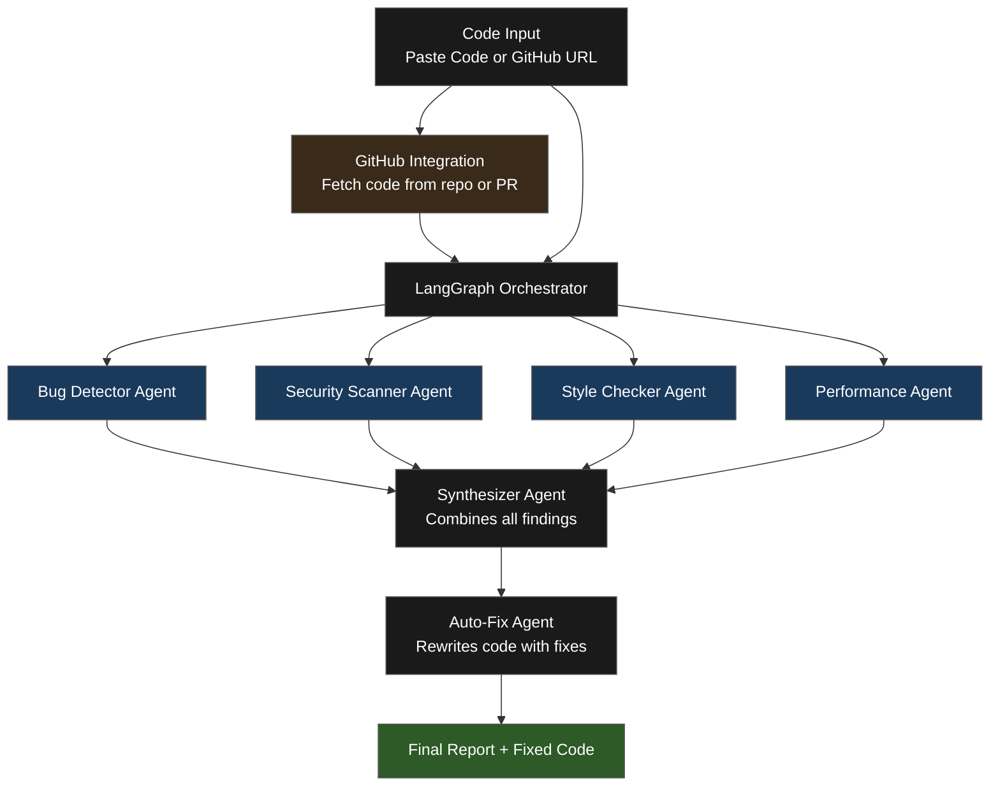

# Autonomous Code Review Agent

An autonomous multi-agent system that reviews code for bugs, security vulnerabilities, style issues, and performance problems, along with providing solutions and code fixes for users to learn and implement, powered by OpenAI GPT-4o and LangGraph.

## Live Demo
[autonomous-code-review-agent.vercel.app](https://autonomous-code-review-agent.vercel.app)

## How It Works

Code is passed through 4 specialized AI agents, which are bug, security, style, and performance agents that run in parallel, each focused on a specific domain of concern. A synthesizer agent then combines all findings into a structured report, followed by an auto-fix agent that rewrites the code with all fixes applied.

