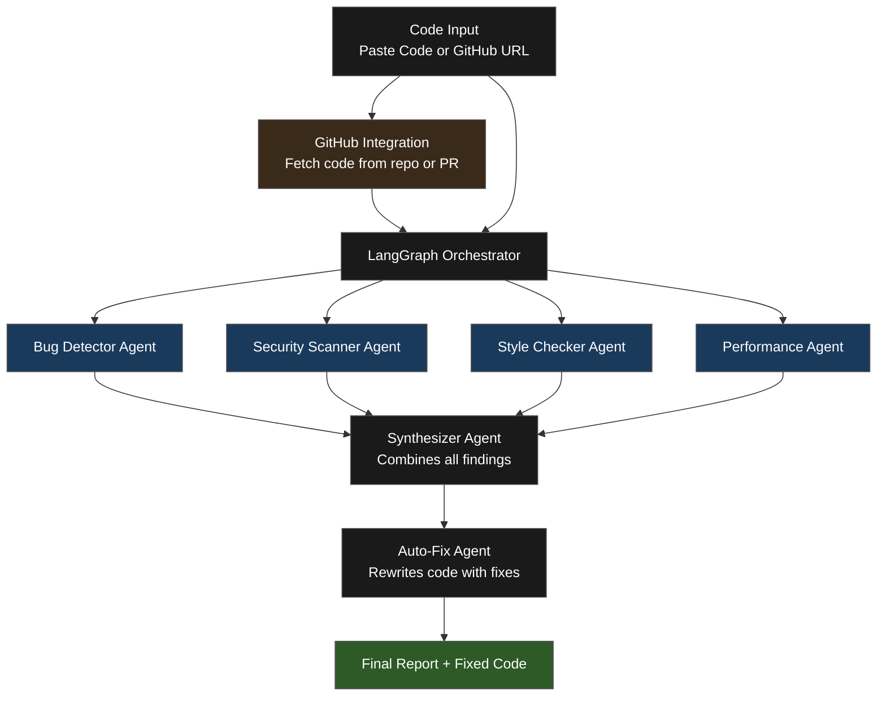

# Autonomous Code Review Agent

An autonomous multi-agent system that reviews code for bugs, security vulnerabilities, style issues, and performance problems, along with providing solutions and code fixes for users to learn and implement, powered by OpenAI GPT-4o and LangGraph.

## Live Demo
[autonomous-code-review-agent.vercel.app](https://autonomous-code-review-agent.vercel.app)

## How It Works

Code is passed through 4 specialized AI agents, which are bug, security, style, and performance agents that run in parallel, each focused on a specific domain of concern. A synthesizer agent then combines all findings into a structured report, followed by an auto-fix agent that rewrites the code with all fixes applied.



## Tech Stack

| Tool | Purpose |
|---|---|
| **OpenAI GPT-4o** | Powers each specialized agent |
| **LangGraph** | Multi-agent orchestration and state management |
| **AsyncIO** | Runs all agents in parallel for faster results |
| **GitHub API** | Fetches code from repos and PRs automatically |
| **FastAPI** | REST API backend |
| **Docker** | Containerized for easy local setup |
| **Railway** | Backend deployment |
| **Vercel** | Frontend deployment |

## Features

- **Multi-agent parallel execution** — 4 specialized agents run simultaneously, not sequentially
- **GitHub integration** — point it at any public repo or PR link and it fetches the code automatically
- **Auto-fix mode** — returns corrected code alongside the review report
- **REST API** — fully exposed via FastAPI, accessible from any client
- **Rate limiting** — prevents API abuse and controls OpenAI token costs
- **CORS enabled** — frontend and backend communicate across different domains

## Getting Started

### Prerequisites
- Docker installed — [docker.com](https://docker.com)
- OpenAI API key — [platform.openai.com](https://platform.openai.com)
- GitHub Personal Access Token — [github.com/settings/tokens](https://github.com/settings/tokens)

### Option 1 — Docker (Recommended)

```bash
git clone https://github.com/B0nitoFlakes/autonomous-code-review-agent.git
cd autonomous-code-review-agent
```

Create a `.env` file in the root:

```
OPENAI_API_KEY=your-openai-api-key
GITHUB_TOKEN=your-github-token
```

Then run:

```bash
docker-compose up --build
```

- Backend: `http://localhost:8000`
- Frontend: `http://localhost:3000`
- API Docs: `http://localhost:8000/docs`

### Option 2 — Manual Setup

```bash
git clone https://github.com/B0nitoFlakes/autonomous-code-review-agent.git
cd autonomous-code-review-agent

python -m venv venv
source venv/bin/activate  # Mac/Linux
venv\Scripts\activate     # Windows

pip install -r requirements.txt
```

Create a `.env` file in the root:

```
OPENAI_API_KEY=your-openai-api-key
GITHUB_TOKEN=your-github-token
```

Run the backend:

```bash
cd backend
uvicorn main:app --reload
```

Open `frontend/index.html` with Live Server or any browser.

## API Endpoints

For API testing purposes, full interactive API documentation available at your deployed backend URL or in your own `http://localhost:8000/docs`.

### Review Code
```
POST /review/code
```
```json
{
    "code": "your code here"
}
```

### Review GitHub URL
```
POST /review/github
```
```json
{
    "url": "https://github.com/username/repo"
}
```

### Health Check
```
GET /
```

## Sample Output

**Review Report:**
```
BUGS FOUND
1. SQL Injection Risk (Line 2): Direct string concatenation vulnerable to injection
2. Hardcoded Password (Line 3): Credentials should not be stored in source code
3. Unused nested loop (Lines 5-7): result list is never populated

SECURITY ISSUES
1. SQL query is not parameterized, vulnerable to injection attacks
2. Password hardcoded in plain text

CODE STYLE
1. Missing docstring on get_user function
2. Parameter named id shadows Python built-in

PERFORMANCE
1. Unnecessary nested loop on Lines 5-7, O(n²) complexity

SUGGESTED FIXES
1. Use parameterized queries instead of string concatenation
2. Move credentials to environment variables
3. Remove redundant nested loop
```

**Fixed Code:**
```python
def get_user(user_id):
    """Retrieve user from database by ID."""
    query = "SELECT * FROM users WHERE id = ?"
    cursor.execute(query, (user_id,))
    return cursor.fetchall()
```

## 🗺️ Roadmap

- [x] Multi-agent system with parallel execution
- [x] LangGraph orchestration
- [x] GitHub PR and repo integration
- [x] Auto-fix mode
- [x] FastAPI REST endpoint
- [x] Rate limiting
- [x] Docker setup
- [x] Deployed on Railway + Vercel
- [ ] Confidence scoring for auto-fix suggestions
- [ ] VS Code extension
- [ ] Support for local models via Ollama for privacy-sensitive codebases
- [ ] Slack and GitHub PR comment integration
- [ ] React + TypeScript frontend rebuild

## ⚠️ Known Limitations

- LLM may occasionally produce inconsistent reviews across runs
- Large repositories may hit context window limits
- Rate limited to 5 requests per minute per IP
- Code is sent to OpenAI API — not recommended for proprietary or sensitive codebases

## 👤 Author

**Marco Setiawan** — [github.com/B0nitoFlakes](https://github.com/B0nitoFlakes)

## 📄 License

MIT License